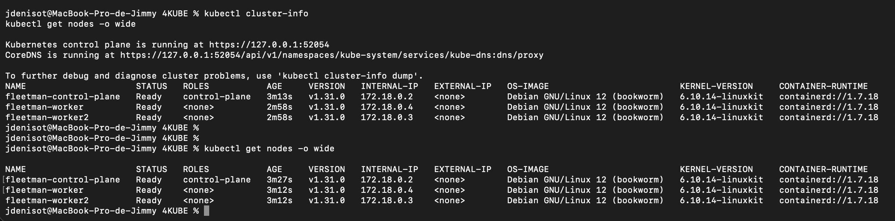
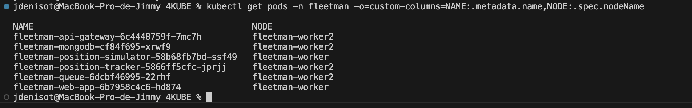
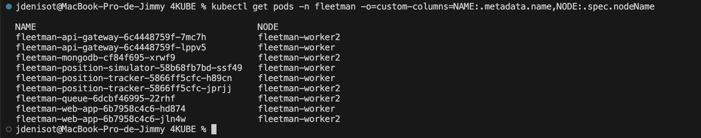

# 4KUBE — Documentation de déploiement Fleetman sur Kubernetes

> Projet : mini-projet Kubernetes — application de suivi de flotte
> 
> Cluster : 1 control-plane + 2 workers (Kind)

---

## Sommaire

1. [Aperçu](#aperçu)
2. [Prérequis](#prérequis)
3. [Création du cluster (Kind)](#création-du-cluster-kind)

   * [Installation de Kind](#installation-de-kind)
   * [Pourquoi Kind ?](#pourquoi-kind-)
   * [Fichier de configuration](#fichier-de-configuration)
   * [Création et vérification](#création-et-vérification)
4. [Déploiement de l’application Fleetman](#déploiement-de-lapplication-fleetman)

   * [Namespace](#namespace)
   * [MongoDB (PVC)](#mongodb-pvc)
   * [ActiveMQ Queue](#activemq-queue)
   * [Position Simulator](#position-simulator)
   * [Position Tracker](#position-tracker)
   * [API Gateway (NodePort 30020)](#api-gateway-nodeport-30020)
   * [Web App (NodePort 30080)](#web-app-nodeport-30080)
   * [Alias inter-namespaces](#alias-inter-namespaces)
   * [Application des manifests](#application-des-manifests)
5. [Tolérance aux pannes (HA) et répartition](#tolérance-aux-pannes-ha-et-répartition)
6. [Accès à l’application](#accès-à-lapplication)
7. [Dépannage](#dépannage)
8. [Nettoyage](#nettoyage)
9. [Arborescence du rendu](#arborescence-du-rendu)
10. [Contributeurs](#contributeurs)
11. [Barème de Notation (40 points)](#barème-de-notation-40-points)
12. [Licence](#licence)


---

## Aperçu

L’application **Fleetman** simule et affiche en temps réel la position de véhicules. Architecture par services :

* **fleetman-position-simulator** (Spring Boot) : émet des positions fictives.
* **fleetman-queue** (Apache ActiveMQ) : file de messages.
* **fleetman-position-tracker** (Spring Boot + REST) : consomme la queue et persiste dans **MongoDB**.
* **fleetman-mongodb** : base de données.
* **fleetman-api-gateway** : point d’entrée backend.
* **fleetman-web-app** : interface web temps réel.

> Les manifests fournis suivent la règle **1 Deployment + 1 Service** par composant (sauf besoin spécifique).

---

## Prérequis

* Docker (daemon actif)
* kubectl
* **Kind** (Kubernetes in Docker)
* Ports libres sur l’hôte : **30080** (web) et **30020** (API)

---

## Création du cluster (Kind)

### Installation de Kind

**Linux**

```bash
curl -Lo ./kind https://kind.sigs.k8s.io/dl/v0.23.0/kind-$(uname)-amd64
chmod +x ./kind && sudo mv ./kind /usr/local/bin/kind
```

**Windows (PowerShell)**

```powershell
choco install kind
```

**macOS**

```bash
brew install kind
```

### Pourquoi Kind ?

**Kind** crée un **vrai cluster multi‑nœuds** à partir de conteneurs Docker via un simple fichier YAML. Idéal pour :

* la **reproductibilité** (partage de la config plutôt que des VM),
* le **travail en équipe**,
* répondre à l’exigence « autre que Docker Desktop / Minikube ».

> ℹ️ Une alternative possible serait **K3d**.

### Fichier de configuration

Créer `kind-config.yaml` à la racine du dépôt :

```yaml
kind: Cluster
apiVersion: kind.x-k8s.io/v1alpha4
name: fleetman
nodes:
  - role: control-plane
    extraPortMappings:
      - containerPort: 30080   # trucks-web-app (NodePort 30080)
        hostPort: 30080
        protocol: TCP
      - containerPort: 30020   # trucks-api-gateway (NodePort 30020)
        hostPort: 30020
        protocol: TCP
  - role: worker
  - role: worker
networking:
  disableDefaultCNI: false
  kubeProxyMode: "iptables"
```

**Remarques**

* Kind embarque déjà un **CNI** ; aucune installation additionnelle requise.
* Les `extraPortMappings` exposent les NodePorts sur `localhost`.

### Création et vérification

Créer le cluster :

```bash
kind create cluster --config kind-config.yaml
```

Vérifier l’état :

```bash
kubectl cluster-info
kubectl get nodes -o wide
```


> Si les workers apparaissent avec le rôle `none`, c’est normal côté Kind. Pour plus de clarté :

```bash
kubectl label node fleetman-worker  node-role.kubernetes.io/worker=worker
kubectl label node fleetman-worker2 node-role.kubernetes.io/worker=worker
```

Exemple attendu :

```
NAME                     STATUS   ROLES           AGE   VERSION   INTERNAL-IP   EXTERNAL-IP   OS-IMAGE                         KERNEL-VERSION     CONTAINER-RUNTIME
fleetman-control-plane   Ready    control-plane   13m   v1.31.0   172.18.0.2    <none>        Debian GNU/Linux 12 (bookworm)   6.10.14-linuxkit   containerd://1.7.18
fleetman-worker          Ready    worker          13m   v1.31.0   172.18.0.4    <none>        Debian GNU/Linux 12 (bookworm)   6.10.14-linuxkit   containerd://1.7.18
fleetman-worker2         Ready    worker          13m   v1.31.0   172.18.0.3    <none>        Debian GNU/Linux 12 (bookworm)   6.10.14-linuxkit   containerd://1.7.18
```

Captures : `src/capture-check-deployer.png`, `src/capture-deployer.png`.

---

## Déploiement de l’application Fleetman

### Namespace

Isoler l’application dans `fleetman` :

```yaml
apiVersion: v1
kind: Namespace
metadata:
  name: fleetman
```

Appliquer avant le reste :

```bash
kubectl apply -f k8s/namespace.yaml
```

### MongoDB (PVC)

* **PersistantVolumeClaim** 1 Gi.
* Service **ClusterIP** (interne uniquement).

Manifeste : `k8s/mongodb.yaml`

### ActiveMQ Queue

* Déploiement de la file **ActiveMQ**.
* Service **ClusterIP** (le broker n’a pas besoin d’être exposé en NodePort).

Manifeste : `k8s/queue.yaml`

> Accès à la console (optionnel) :
>
> ```bash
> kubectl port-forward svc/fleetman-queue 8161:8161 -n fleetman
> ```

### Position Simulator

* Émet des positions vers la queue via le **DNS de service** `fleetman-queue`.
* **Profil Spring** : `SPRING_PROFILES_ACTIVE=production-microservice`.

Manifeste : `k8s/position-simulator.yaml`

### Position Tracker

* Consomme la queue et sert l’API REST.
* **Profil Spring** : `production-microservice`.

Manifeste : `k8s/position-tracker.yaml`

### API Gateway (NodePort 30020)

* Point d’entrée backend.
* Exposé en **NodePort 30020** et mappé par Kind sur l’hôte.

Manifeste : `k8s/api-gateway.yaml`

### Web App (NodePort 30080)

* Interface web publique.
* Image : `supinfo4kube/web-app:1.0.0` (⚠️ *et non* `...:1.0.0-dockercompose`).
* Exposée en **NodePort 30080**.

Manifeste : `k8s/web-app.yaml`

### Alias inter-namespaces

Certains conteneurs référencent des services dans le namespace `default`. Pour assurer la résolution DNS, des **alias `ExternalName`** sont créés dans `default` et pointent vers les services réels du namespace `fleetman`.

Manifeste ciblé : `k8s/api-gateway-alias.yaml`

Manifeste groupé : `k8s/default-aliases.yaml`

### Application des manifests

Dans l’ordre :

```bash
kubectl apply -f k8s/namespace.yaml
kubectl apply -f k8s/mongodb.yaml
kubectl apply -f k8s/queue.yaml
kubectl apply -f k8s/position-simulator.yaml
kubectl apply -f k8s/position-tracker.yaml
kubectl apply -f k8s/api-gateway.yaml
kubectl apply -f k8s/web-app.yaml
kubectl apply -f k8s/api-gateway-alias.yaml
kubectl apply -f k8s/default-aliases.yaml
```

Vérifications :

```bash
kubectl get pods -n fleetman
kubectl get svc  -n fleetman
```

---

## Tolérance aux pannes (HA) et répartition

L’exigence **« disponible si un worker tombe »** implique des **réplicas ≥ 2** pour les composants critiques. Recommandations :

| Déploiement                   | Réplicas | Motif                               |
| ----------------------------- | -------: | ----------------------------------- |
| `fleetman-web-app`            |        2 | Continuité de l’UI si un nœud tombe |
| `fleetman-api-gateway`        |        2 | Routage backend résilient           |
| `fleetman-position-tracker`   |        2 | API/traitement résilient            |
| `fleetman-position-simulator` |        1 | Non critique                        |
| `fleetman-queue`              |        1 | ActiveMQ non clusterisé             |
| `fleetman-mongodb`            |        1 | Replica set hors périmètre          |

Mettre à jour puis appliquer les manifests concernés :

```bash
kubectl apply -f k8s/api-gateway.yaml
kubectl apply -f k8s/web-app.yaml
kubectl apply -f k8s/position-tracker.yaml
```

Contrôler la **répartition des pods** :

```bash
kubectl get pods -n fleetman -o=custom-columns=NAME:.metadata.name,NODE:.spec.nodeName
```

Captures : `src/capture-repartition.png`, `src/capture-replicat.png`.
- avant:

- après:


> Astuce (optionnelle) : ajouter `topologySpreadConstraints` ou `podAntiAffinity` dans les templates pour **forcer** la répartition sur plusieurs nœuds. (non nécessaire)

---

## Accès à l’application

Après déploiement :

* **Web App** → [http://localhost:30080](http://localhost:30080)
* **API Gateway** → [http://localhost:30020](http://localhost:30020)

> Raccourci : `kubectl apply -f k8s/` appliquera tous les manifests du dossier.

---

## Dépannage

* **La carte charge mais aucun véhicule n’apparaît**

  * Vérifier que **ActiveMQ** est up : `kubectl get pods -n fleetman | grep queue`.
  * Redémarrer la queue : `kubectl rollout restart deploy/fleetman-queue -n fleetman`.
  * Vérifier les logs du **position-simulator** : `kubectl logs deploy/fleetman-position-simulator -n fleetman`.

* **404/timeout depuis la Web App**

  * Vérifier le Service **api-gateway** et l’alias `ExternalName`.
  * Confirmer que la Web App utilise bien `supinfo4kube/web-app:1.0.0`.

* **Accès localhost impossible**

  * S’assurer que le cluster Kind a bien mappé les ports 30080/30020.
  * Contrôler que les Services sont en **NodePort** avec les bons ports.

* **Pods non répartis**

  * Réplicas des composants critiques ≥ 2.
  * Utiliser des contraintes de répartition (voir astuce HA ci‑dessus).

---

## Nettoyage

Détruire le cluster Kind :

```bash
kind delete cluster --name fleetman
```

---

## Arborescence du rendu

```
.
├── doc.md
├── k8s
│   ├── api-gateway-alias.yaml
│   ├── api-gateway.yaml
│   ├── default-aliases.yaml
│   ├── mongodb.yaml
│   ├── namespace.yaml
│   ├── position-simulator.yaml
│   ├── position-tracker.yaml
│   ├── queue.yaml
│   └── web-app.yaml
├── kind
├── kind-config.yaml
└── src
    ├── capture-check-deployer.png
    ├── capture-deployer.png
    ├── capture-repartition.png
    └── capture-replicat.png
```

> **Livrable** : un **.zip** unique contenant l’intégralité des fichiers ci‑dessus.

---

## Contributeurs

* [Jimmy Denisot](https://github.com/JDENISOT)
* [Paul Mareschi](https://github.com/Paul-Mrsch)
* [Telio Andre](https://github.com/telioandre)

---

## Barème de Notation (40 points)
voir fichier [notation.md](notation.md) pour les détails

---
## Licence
 
© 2024 Jimmy Denisot, Paul Mareschi, Telio Andre.
Ce projet a été réalisé dans le cadre d'un cours universitaire et est mis à disposition sous licence MIT. Voir le fichier [LICENSE](LICENSE) pour plus de détails.

---

### Annexe — Références d’images et profils Spring

* Profils Spring à utiliser : `SPRING_PROFILES_ACTIVE=production-microservice` pour **api-gateway**, **position-simulator**, **position-tracker**.
* Image Web App correcte : `supinfo4kube/web-app:1.0.0`.

> Les Services **MongoDB** et **Queue** restent en **ClusterIP** (accès interne). Les Services **Web App** et **API Gateway** sont exposés en **NodePort** car accessibles depuis l’hôte via les `extraPortMappings` Kind.
